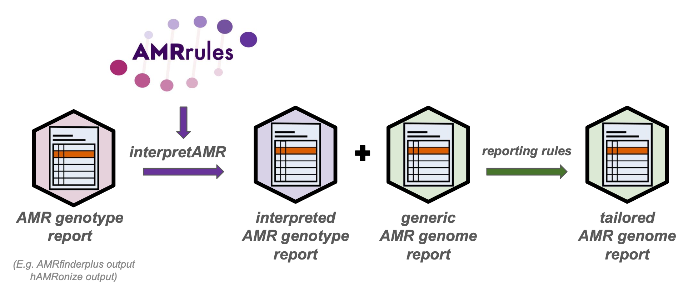

# Interpretive standards for AMR genotypes

Our goal is to develop interpretive standards for AMR genotypes, akin to the interpretive standards developed by [EUCAST](https://www.eucast.org/) and [CLSI](https://clsi.org/) for antimicrobial susceptibility phenotyping. 

An overview of the concept, with example data structures and code, is available below.

We are partnering with [ESGEM, the ESCMID Study Group on Epidemiological Markers](https://www.escmid.org/esgem/), to form an ESGEM-AMR Working Group to curate organism-specific rule sets. Membership of the working group is open to anyone with relevant expertise, you do not have to be an ESGEM member. 

If you would like to get involved, please:

1. Consider [registering to attend](https://forms.gle/9cBP821bDmyyaVZe8) one of the intro sessions to find out if this is the group for you:
* Tues 14 May 17:00 UK / 9:00 Seattle / 12:00 Boston
* Weds 15 May 9:00 UK /  15:00 Hanoi / 18:00 Melbourne
2. If you decide you want to join the ESGEM-AMR working group please register your interest, and let us know what organism/s you have expertise in, using [this form](https://forms.gle/QjvQNuB3vCHGMiiA7).


# Introduction

Organism-specific interpretation of antimicrobial susceptibility testing (AST) data is standard in clinical microbiology, with rules regularly reviewed by expert committees of [CLSI](https://clsi.org/) and [EUCAST](https://www.eucast.org/). EUCAST also maintains lists of [expert rules](https://www.eucast.org/expert_rules_and_expected_phenotypes) for some species, including [expected (intrinsic) resistance](https://www.eucast.org/expert_rules_and_expected_phenotypes/expected_phenotypes) and expected susceptibility phenotypes, to guide clinical labs in deciding which drugs to test and whether/how to report them.

We propose there is a similar need for systematic rules for the organism-specific interpretation of antimicrobial resistance (AMR) genotypes derived from pathogen whole genome sequence (WGS) data.

Current solutions focus on bespoke solutions for specific organisms (e.g. our [Kleborate](https://github.com/klebgenomics/Kleborate) tool for _Klebsiella pneumoniae_; Pathogenwatch [AMR libraries](https://gitlab.com/cgps/pathogenwatch/amr-libraries) for [_Salmonella_ Typhi](https://doi.org/10.1038/s41467-021-23091-2), [_Neisseria gonorrhoeae_](https://doi.org/10.1186/s13073-021-00858-2) and others; [Resfinder 4.0](https://bitbucket.org/genomicepidemiology/resfinder_db/src/master/) for _E. coli_ and others; [Mykrobe](https://github.com/Mykrobe-tools/mykrobe) and [TBProfiler](https://github.com/jodyphelan/TBProfiler) tools for _Mycobacterium tuberculosis_), but this complicates bioinformatics analyses and promotes fragmentation rather than consolidation of expertise. [AbritAMR](https://github.com/MDU-PHL/abritamr) offers a potential solution for multiple organisms, but organism-specific interpretation rules are hard-coded in Python and separated from supporting evidence, making the logic difficult for others to curate and update.

This repo outlines a proposal for a simple data structure to store organism-specific rules for the interpretation of AMR genotype data, that could be used to enrich the outputs of standard AMR genotyping tools (such as AMRfinderplus and other tools, with or without [hAMRonization](https://github.com/pha4ge/hAMRonization)) and generate informative genome reports that capture expert knowledge about how core genes contribute to antimicrobial susceptibility.

Example rules are given for _Klebsiella pneumoniae_, and [example code](https://github.com/interpretAMR/AMRrules/blob/main/parse_amrfinder.py) is given to annotate NCBI [AMRfinderplus](https://www.ncbi.nlm.nih.gov/pathogens/antimicrobial-resistance/AMRFinder/) results for _Klebsiella pneumoniae_ using these rules.

The rule specification (still a work in progress) is available in [this Google sheet](https://docs.google.com/spreadsheets/d/1N0HXK8T5EH-4XDonvW5RmAm8tJTb1RlIMB1oF2x4ss8/edit?usp=sharing) (guidance on tab 2).


## Data analysis pipeline



## Organism-specific rules


Example file: [organism_specific_rules.tsv](organism_specific_rules.tsv)

Full specification (work in progress): [AMR rules specification](https://docs.google.com/spreadsheets/d/1N0HXK8T5EH-4XDonvW5RmAm8tJTb1RlIMB1oF2x4ss8/edit?usp=sharing). Note this includes some additional fields, and guidance on tab 2.

## Annotated gene table


Example file: [annotated_gene_report.tsv](annotated_gene_report.tsv)

### Example code

The example annotated gene report can be generated by running AMRfinderplus, and then annotating the output with the above organism-specific rules for _Klebsiella pneumoniae_, using [parse_amrfinder.py](parse_amrfinder.py)


```
amrfinder -n example_data_kleb/ERR257656.fasta --plus
                                               --print_node
                                               --name ERR257656
                                               --organism Klebsiella_pneumoniae
                                               > ERR257656_amrFinderPlusOutput.tsv

./parse_amrfinder.py --reports example_data_kleb/*_amrFinderPlusOutput.tsv 
                     --species 'Klebsiella pneumoniae'
                     --organism_rules organism_specific_rules.tsv
                     --drug_dictionary example_dict_kleb/Kleb_local_dict.tsv
                     --output example_annotatedAMRreport.tsv
```

## Genome report


Example file (PDF): [genome_report.pdf](genome_report.pdf)

Example file (RTF): [genome_report.rtf](genome_report.rtf)

## Contributors
This concept was workshopped by members of the [Holt lab](https://holtlab.net) at [London School of Hygiene and Tropical Medicine](https://www.lshtm.ac.uk) and further developed in collaboration with [Jane Hawkey](https://github.com/jhawkey) at [Monash University](https://research.monash.edu/en/persons/jane-hawkey).
