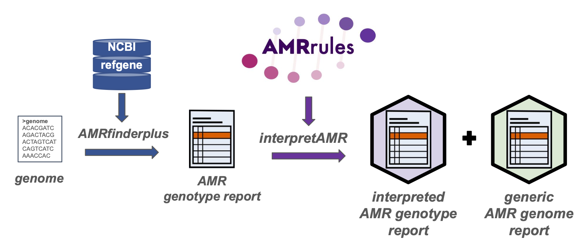

[](https://zenodo.org/doi/10.5281/zenodo.12724317)

# Interpretive standards for AMR genotypes


Organism-specific interpretation of antimicrobial susceptibility testing (AST) data is standard in clinical microbiology, with rules regularly reviewed by expert committees of [EUCAST](https://www.eucast.org/) and [CLSI](https://clsi.org/). We aim to provide an analagous resource to support organism-specific interpretation of antimicrobial resistance (AMR) genotypes derived from pathogen whole genome sequence (WGS) data.

AMRrules encode organism-specific rules for the interpretation of AMR genotype data, and are curated by organism experts belonging to [ESGEM-AMR](https://github.com/interpretAMR/AMRrulesCuration/), a working group of [ESGEM, the ESCMID Study Group on Epidemiological Markers](https://www.escmid.org/esgem/). The rule specification is available in [this Google sheet](https://docs.google.com/spreadsheets/d/1F-J-_8Kyo3W0Oh6eDYyd0N8ahqVwiddM2112-Fg1gKc/edit?usp=sharing) (v0.5, guidance on tab 2).

This AMRrules Python package includes the rules themselves (see `rules/` directory) as well as code to apply the rules to interpret AMR genotypes (currently limited to [AMRfinderplus](https://www.ncbi.nlm.nih.gov/pathogens/antimicrobial-resistance/AMRFinder/) output), generating informative genome reports that capture expert knowledge about how core and acquired genes and mutations contribute to antimicrobial susceptibility. 

We are focusing early development on compatibility with NCBI resources (i.e. the [AMRfinderplus](https://www.ncbi.nlm.nih.gov/pathogens/antimicrobial-resistance/AMRFinder/) genotyping tool, and the associated NCBI databases including [AMR refgene](https://www.ncbi.nlm.nih.gov/pathogens/refgene/), [AMR Reference Gene Hierarchy](https://www.ncbi.nlm.nih.gov/pathogens/genehierarchy), and the [Reference HMM Catalog](https://www.ncbi.nlm.nih.gov/pathogens/hmm/)). In future we plan for interoperability with [CARD](https://card.mcmaster.ca/) and [ResFinder](http://genepi.food.dtu.dk/resfinder) (and other tools based on these), using [hAMRonization](https://github.com/pha4ge/hAMRonization).

Initial rule curation has focused on defining rules for the interpretation of core genes and expected resistances, but acquired genes and mutations are included for some organisms already and will be added to others as the necessary data to define them accurately is accumulated and curated by the ESGEM-AMR working group.

## Organism-specific rules


Full specification: [AMRrules spec v0.5](https://docs.google.com/spreadsheets/d/1F-J-_8Kyo3W0Oh6eDYyd0N8ahqVwiddM2112-Fg1gKc/edit?usp=sharing). Note this includes several additional fields beyond those pictured above, including NCBI and CARD ARO accessions to uniquely identify genes; details of the breakpoints and standards used; evidence codes, grades and limitations; and a rule annotation note.

### Available rules

Rule curation is a work in progress, under active development by the [ESGEM-AMR](https://github.com/interpretAMR/AMRrulesCuration/) Working Group.

Currently available rule sets are in the [rules/](rules/) directory of this repository, named by organism. In this beta release they focus mainly on core genes and expected resistances, however acquired genes and mutations are included for some organisms already and will be added to others as the necessary data to define them accurately is accumulated and curated by the ESGEM-AMR working group.

* [Acinetobacter baumannii](rules/Acinetobacter_baumannii.txt)
* [Enterobacter](rules/Enterobacter.txt)
* [Enterococcus faecalis](rules/Enterococcus_faecalis.txt)
* [Enterococcus faecium](rules/Enterococcus_faecium.txt)
* [Escherichia coli](rules/Escherichia_coli.txt)
* [Klebsiella pneumoniae](rules/Klebsiella_pneumoniae.txt)
* [Neisseria gonorrhoeae](rules/Neisseria_gonorrhoeae.txt) (acquired resistances, based on analysis of geno-pheno data)
* [Pseudomonas aeruginosa](rules/Pseudomonas_aeruginosa.txt)
* [Salmonella](rules/Salmonella.txt)
* [Staphylococcus aureus](rules/Staphylococcus_aureus.txt)
* [Yersinia](rules/Yersinia.txt)


## Interpreting AMRfinderplus genotype results with AMRrules



### Package installation

The only dependency is Python, v3.12 or higher

```
conda create -n amrrules_beta -c bioconda python=3.12

conda activate amrrules_beta

conda install pip

git clone https://github.com/interpretAMR/AMRrules

cd AMRrules

make dev
```

Use AMRrules to interpret AMRfinderplus results for a single genome

```
amrrules --input tests/data/input/test_ecoli_genome.tsv --output_prefix test_ecoli_genome --organism 's__Escherichia coli'

amrrules --input tests/data/input/test_kleb_SGH10.tsv --output_prefix test_kleb_SGH10 --organism 's__Klebsiella pneumoniae'
```


Use AMRrules to interpret results for multiple genomes of different organisms (test data)

```
amrrules  --input tests/data/input/test_data_amrfp_multiSpp.tsv --output_prefix test_multispp --organism_file tests/data/input/test_data_sppCalls.tsv
```


Example command to run AMRfinder plus (note the --print_node option)
and interpret the output with AMRrules

```
amrfinder -n Kpn1.fasta --plus --print_node --name Kpn1 --organism Klebsiella_pneumoniae > Kpn1_AMRfp.tsv

amrrules --input Kpn1_AMRfp.tsv --output_prefix Kpn1 --organism 's__Klebsiella pneumoniae'
```


## Example interpreted genotype report


Example interpreted summary output for wildtype _Klebsiella pneumoniae_ str. SGH10

Note the image includes only selected fields from the AMRfinderplus report, for illustration purposes. The AMRrules output file includes all columns in the input genotype file, with the additional AMRrules annotation columns (highlighted in purple) added to the end.

Example file, generated using test commands above: [test_kleb_SGH10_interpreted.tsv](tests/data/output/test_kleb_SGH10_interpreted.tsv)

Example file with multiple genomes from different species, generated using test commands above: [test_multiSpp_interpreted.tsv](tests/data/output/test_multiSpp_interpreted.tsv)

## Example generic genome report
_Work in progress, not yet available in the beta release_

## Contributors
The AMRrules concept was initially workshopped by members of the [Holt lab](https://holtlab.net) at [London School of Hygiene and Tropical Medicine](https://www.lshtm.ac.uk) and further developed in collaboration with [Jane Hawkey](https://github.com/jhawkey) at [Monash University](https://research.monash.edu/en/persons/jane-hawkey). The AMRrules specification was developed by the ESGEM-AMR Data & Tools group, and the rules curated by the ESGEM-AMR Working Group (see [list of members](https://github.com/interpretAMR/AMRrulesCuration/)), chaired by Natacha Couto (ESGEM Chair). Code was developed by Jane Hawkey and Kat Holt.
