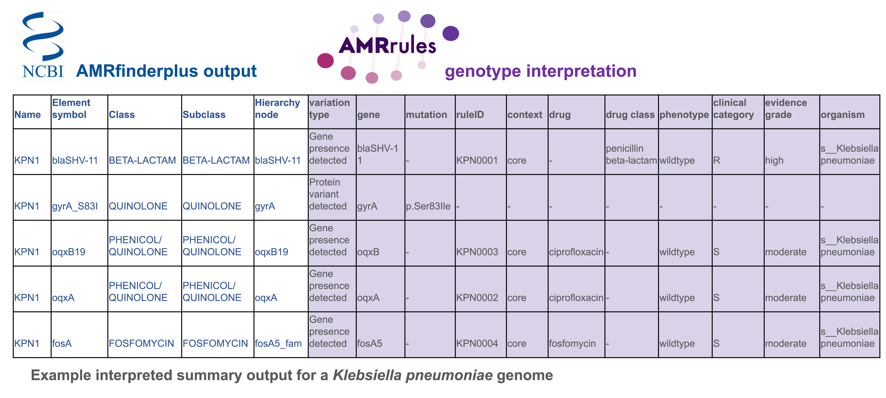

*******************************
Interpretation logic and output
*******************************

Interpreted AMRFinderplus output
================================

When given an AMRFinderPlus input file, and an organism, AMRrules will apply the most relevant organism-specific rule to each AMRFinderPlus AMR genotype call. Below is an abbreviated example of the interpreted output file generated by AMRrules. (More examples can be found in :ref:`Tests <test>`).

When parsing the AMRFinderPlus input file, AMRrules will first identify what ``variation type`` each genotype call belongs to, the ``gene`` found, and if there is a mutation in the gene, this mutation will be converted to the :ref:`AMRrules syntax <syntax>`.

The table below shows the logic of how AMRrules maps AMRFinderPlus genotype calls to the different variation types:

================================ ================================ =====================================================
Variation type                   AMRFP Method                     Additional logic
================================ ================================ =====================================================
Gene presence detected           EXACT, ALLELE, BLAST
Protein variant detected         POINTX, POINTP
Nucleotide variant detected      POINTN
Promoter variant detected        POINTN                           ``-`` symbol present before the nucleotide position
Inactivating mutation detected   INTERNAL_STOP, PARTIAL, POINTX   If POINTX, Subtype must be POINT_DISRUPT
================================ ================================ =====================================================
                           

The parsed ``variation type``, ``gene``, and ``mutation`` columns are added to the interpreted output file, next to the original AMRFinderPlus columns.

.. note::

   If ``--print-non-amr`` is provided to AMRrules, then any additional hits from AMRFinderPlus that are not AMR-related (eg virulence, stress, or metal resistance genes) will also be included in the interpreted output file. These entries will have ``variation type`` set to ``Non-AMR element``, and ``gene`` and ``mutation`` set to ``-``. No rules will be applied to these entries, and all annotation columns will be set to ``-``.

**Drug mapping**

AMRrules maps the AMRFinderPlus calls to ``drug`` or ``drug class`` names from the CARD ARO, by parsing the ``Subclass`` columns. The dictionary used to map AMRFinderPlus ``Subclass`` to CARD ontology is in the AMRrules repository under ``src/amrrules/resources/amrfp_to_card_drugs_classes.txt``.

Some genotype calls have multiple entries in the AMRFinderPlus ``Subclass`` field. In such cases, the annotated calls output by AMRrules will contain multiple copies of the genotype row, one for each mapped drug/class. E.g. `aac6-Ib-cr <https://www.ncbi.nlm.nih.gov/pathogens/refgene/#aac6-Ib-cr>`__ is assigned to Subclass "AMIKACIN/KANAMYCIN/QUINOLONE/TOBRAMYCIN" in refgene/AMRfinderplus, so the AMRrules-annotated genotype file will contain 4 rows for this gene, one each for ``drug`` = ``amikacin``, ``drug`` = ``tobramycin``, ``drug`` = ``kanamycin``, and ``drug class`` = ``fluoroquinolone antibiotic``

Rule matching
^^^^^^^^^^^^^

When matching a genotype call with a rule, the following logic applies:

1. AMRrules will select all rules matching the ``variation type``.
2. AMRrules will filter all possible rules to check if the ``nodeID`` from the rule matches to ``Hierarchy node``. If not, it will check the parent nodes of ``Hierarchy node`` to look for a matching ``nodeID``.
3. If no matching ``nodeID`` is found, AMRrules will then check for matching accessions in the following order:

   a. ``nucleotide accession``
   b. ``protein accession``
   c. ``HMM accession``

For each matching rule, AMRrules appends the following fields from the rules file to the AMRFinderPlus genotype call:

* ruleID
* gene context
* drug
* drug class
* phenotype
* clinical category
* evidence grade
* version
* organism

To get more detailed annotation, set ``--annot-opts full``, which will add the following additional fields from the rule file:

* breakpoint
* breakpoint standard
* breakpoint condition
* evidence code
* evidence limitations
* PMID
* rule curation note

.. note::

   If multiple rules match to a genotype call, then the genotype call is duplicated, and the relevant information from additional rules is appended. For example, if the genotype call for ``aac(3)`` matches to two different rules, one for amikacin and one for kanamycin, then the ``aac(3)`` row will be represented twice in the output file, and the rule information for the amikacin will be appended on one row, and kanamycin on the second row.

The resulting output file is stored as ``<output_prefix>_interpreted.tsv``.

Genome summary report
=====================

In addition to the interpreted AMRFinderPlus output file, AMRrules will also generate a genome summary report, stored as ``<output_prefix>_summary.tsv``. This file summarises the resistance per drug/drug class, based on the matched rules.

The following columns are included:

=================== ====================================================================================================
  Column              Explanation                                                                                                              
=================== ====================================================================================================
  sample              Sample ID                                                                                                                
  drug                Drug, as per CARD ARO. AMRFinderPlus drugs will be converted to CARD ARO format by AMRrules                              
  drug class          Drug class, as per CARD ARO. AMRFinderPlus drugs will be converted to CARD ARO format by AMRrules                       
  clinical category   S/I/R. Highest level of resistance based on markers that match this drug/drug class                                  
  phenotype           Wildtype or nonwildtype. Highest level based on markers that match this drug/drug class                                  
  evidence grade      Very low/low/moderate/high. Highest grade of evidence for markers that match this drug/drug class                       
  markers (non-S)     Markers with rules specifying clinical category I or R, separated by ``;``
  markers (no rule)   Markers with no rule, separated by ``;``                                                                 
  markers (S)         Markers with rules specifying clinical category S, separated by ``;``                      
  ruleIDs             List of IDs for single-marker rules that apply to this drug/drug class, separated by ``;``                                                     
  combo rules         List of IDs multi-marker (combination) rules that apply to this drug/drug class, separated by ``;``
  organism            Organism whose rules were applied                                                                                  
=================== ====================================================================================================

**Marker labels** 

• Marker labels are formatted as ``gene:mutation``, where the mutation is formatted using :ref:`AMRrules syntax <syntax>`
• If the variation type is ``Gene inactivating mutation`` the marker will be labelled as ``gene:-`` (where the ``-`` implies inactivation or functional loss).
• If the variation type is ``Gene presence detected``, the marker label will be simply ``gene``. 
• If ``flag-core`` has been switched on, markers with rules that have ``gene context == 'core'`` will be flagged with ``(core)`` after the marker. This is the case only if the ``variation type`` for that marker is ``Gene presence detected``. eg the core blaSHV gene in *K. pneumoniae* will now be in the ``markers (non-S)`` column as ``blaSHV-11 (core)`` for penicillin beta-lactam.

.. note::

   AMRFinderPlus genotype calls detected using POINT_DISRUPT contain detailed information about the disruption, which is formatted using HGVS syntax. For simplicity, by default the AMRrules genome summary report **will not show** the full mutation after the gene when listing these markers in the genome summary (although they can always be found in the annotated genotype report). Rather, they will be formatted in the genome summary report as ``gene:-`` as per other inactivating mutations. If you wish to show the full mutation detected by AMRFinderPlus in the summary report, this can be turned on by providing the option ``--full-disrupt`` to the AMRrules call.

Handling unmatched genotype calls
^^^^^^^^^^^^^^^^^^^^^^^^^^^^^^^^^

By default, if no organism-specific rule is found for a genotype reported by AMRfinderplus, AMRrules will apply an interpretation based on the setting of ``--no-rule-interpretation``. By default, this is set to ``nwtR``, meaning any unmatched genotype call will be assigned the phenotype ``nonwildtype`` and the clinical category of ``R``. Users can change this to ``nwtS``, meaning any unmatched genotype call will be assigned the phenotype ``nonwildtype`` and clinical category of ``S``.

In all cases, genotype calls with no rules will be assigned an evidence grade of ``very low`` for the purposes of the summary report.
