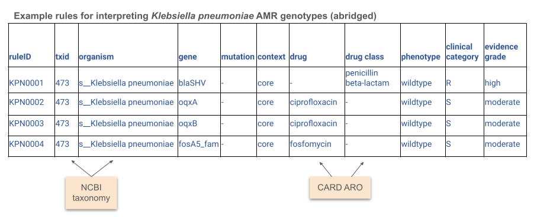

*****************************
Rules and supported organisms
*****************************

.. _rules:
Available rules
===============

Currently available rule sets are in the ``rules/`` directory of this repository, named by organism. In this release they focus mainly on core genes and expected resistances, however acquired genes and mutations are included for some organisms already and will be added to others as the necessary data to define them accurately is accumulated and curated by the ESGEM-AMR working group.

Note that multiple organisms can exist within a rules file, particularly if the rules file belongs to a genus, or the named species belongs to a species complex (eg *Klebsiella oxytoca*). 

Rules can be browsed interactively using the `AMRrules Browser <https://browse.amrrules.org/>`__.

A full list of supported organisms can be found below.

* `Acinetobacter baumannii <https://github.com/AMRverse/AMRrules/blob/main/rules/Acinetobacter_baumannii.tsv>`__
* `Bordetella <https://github.com/AMRverse/AMRrules/blob/main/rules/Bordetella.tsv>`__
* `Burkholderia pseudomallei <https://github.com/AMRverse/AMRrules/blob/main/rules/Burkholderia_pseudomallei.tsv>`__
* `Campylobacter jejuni <https://github.com/AMRverse/AMRrules/blob/main/rules/Campylobacter_jejuni.tsv>`__
* `Enterobacter <https://github.com/AMRverse/AMRrules/blob/main/rules/Enterobacter.tsv>`__
* `Enterococcus faecalis <https://github.com/AMRverse/AMRrules/blob/main/rules/Enterococcus_faecalis.tsv>`__
* `Enterococcus faecium <https://github.com/AMRverse/AMRrules/blob/main/rules/Enterococcus_faecium.tsv>`__
* `Escherichia coli <https://github.com/AMRverse/AMRrules/blob/main/rules/Escherichia_coli.tsv>`__
* `Klebsiella oxytoca <https://github.com/AMRverse/AMRrules/blob/main/rules/Klebsiella_oxytoca_complex.tsv>`__ (including other species in the complex)
* `Klebsiella pneumoniae <https://github.com/AMRverse/AMRrules/blob/main/rules/Klebsiella_pneumoniae.tsv>`__
* `Legionella <https://github.com/AMRverse/AMRrules/blob/main/rules/Legionella.tsv>`__
* `Mycobacterium tuberculosis <https://github.com/AMRverse/AMRrules/blob/main/rules/Mycobacterium_tuberculosis.tsv>`__
* `Neisseria gonorrhoeae <https://github.com/AMRverse/AMRrules/blob/main/rules/Neisseria_gonorrhoeae.tsv>`__ (includes acquired resistances, based on analysis of geno-pheno data)
* `Neisseria meningitidis <https://github.com/AMRverse/AMRrules/blob/main/rules/Neisseria_meningitidis.tsv>`__
* `Proteus mirabilis <https://github.com/AMRverse/AMRrules/blob/main/rules/Proteus_mirabilis.tsv>`__
* `Pseudomonas aeruginosa <https://github.com/AMRverse/AMRrules/blob/main/rules/Pseudomonas_aeruginosa.tsv>`__
* `Salmonella enterica <https://github.com/AMRverse/AMRrules/blob/main/rules/Salmonella_enterica.tsv>`__
* `Shewanella <https://github.com/AMRverse/AMRrules/blob/main/rules/Shewanella.tsv>`__
* `Staphylococcus aureus <https://github.com/AMRverse/AMRrules/blob/main/rules/Staphylococcus_aureus.tsv>`__
* `Yersinia <https://github.com/AMRverse/AMRrules/blob/main/rules/Yersinia.tsv>`__

Supported organisms
===================

A full list of supported organisms can be found by running ``amrrules --list-organisms``. Currently supported organisms are:

* g__Legionella
* s__Acinetobacter baumannii
* s__Bordetella bronchiseptica
* s__Bordetella hinzii
* s__Bordetella holmesii
* s__Bordetella parapertussis
* s__Bordetella pertussis
* s__Burkholderia pseudomallei
* s__Campylobacter jejuni
* s__Enterobacter hormaechei
* s__Enterobacter roggenkampii
* s__Enterococcus faecalis
* s__Enterococcus faecium
* s__Escherichia coli
* s__Klebsiella grimontii
* s__Klebsiella huaxiensis
* s__Klebsiella michiganensis
* s__Klebsiella oxytoca
* s__Klebsiella pasteurii
* s__Klebsiella pneumoniae
* s__Klebsiella spallanzanii
* s__Legionella longbeachae
* s__Legionella pneumophila
* s__Mycobacterium tuberculosis
* s__Neisseria gonorrhoeae
* s__Neisseria meningitidis
* s__Proteus mirabilis
* s__Pseudomonas aeruginosa
* s__Salmonella enterica
* s__Shewanella algae
* s__Staphylococcus aureus
* s__Yersinia enterocolitica
* s__Yersinia pseudotuberculosis

Rule specification
==================

The full rule specification can be found in the :ref:`AMRrules specification <specification>` section. An abbreviated rules file is shown below.

Note the full specification includes several additional fields beyond those pictured above, including NCBI and CARD ARO accessions to uniquely identify genes; details of the breakpoints and standards used; evidence codes, grades and limitations; and a rule annotation note.

Rule curation is a work in progress, under active development by the `ESGEM-AMR <https://esgem-amr.amrrules.org/>`__ Working Group.
